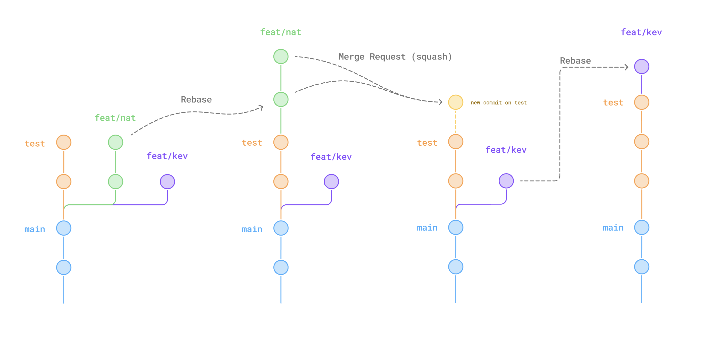

[README](../../README.md) > [NextJS Deploy](./1-setup-local.md) > **Git Usage**

[← MCP Servers](./6-mcp-servers.md) | [GitHub Pipelines →](./8-github-pipelines.md)

---

# Git Usage

Best practices for team collaboration with Git.

## Pre-commit Hooks

Husky runs `lint-staged` on every commit: ESLint fix + Prettier fix on staged files.

```
.husky/pre-commit → pnpm lint-staged
```

What lint-staged does:

- `*.{js,ts,tsx}` → `eslint --fix`
- `*.{js,ts,tsx,json,css,md,yml,yaml}` → `prettier --write`

If lint-staged fails, the commit is rejected. Fix the issues and commit again.

## Conventional Commits

Commits follow [Conventional Commits](https://www.conventionalcommits.org/) format, enforced by **commitlint** (`@commitlint/config-conventional`).

Format:

```
type: description
```

Types:

- **`feat`** — new feature
- **`fix`** — bug fix
- **`docs`** — documentation
- **`style`** — formatting (no code change)
- **`refactor`** — code restructuring (no feature/fix)
- **`test`** — add/update tests
- **`chore`** — tooling, config, dependencies

Breaking changes:

```
feat!: remove legacy API endpoint
```

> [!NOTE]
> Conventional commits are the foundation for [Semantic Release](./8-github-pipelines.md) (planned): commit types automatically determine version bumps (`feat` = minor, `fix` = patch, `feat!` = major).

> [!NOTE]
> Commit and push regularly: after each working addition, bug fix, or at the end of the day. If you work on multiple computers, be extra rigorous to avoid conflicts.

## Branches

### Naming

```
{type}/{dev-name}-{feature-or-ticket-id}
```

Examples:

- `feat/nans-auth-flow`
- `fix/kev-cart-total`
- `docs/nans-api-reference`

### Roles

- **`main`** — production branch, deployed to production. Handled by lead dev only.
- **`test`** — integration branch, deployed to preview. Features are merged here via PR (squash). Handled by lead dev only.
- **Feature branches** — created from `test`, one per feature/fix, handled by the developer.

### Flow

```
           PR (squash)           PR (merge)
feat/xxx ---------------> test --------------> main
                            ↓                   ↓
                         preview            production
```

## Rebase Workflow

> [!IMPORTANT]
> Always use **rebase**, never merge. Rebase keeps a linear history — your commits are added after the target branch. Merge creates merge commits that make history harder to read and cause more conflicts.



> [!TIP]
> The first time, create a backup branch before rebasing: `git checkout -b backup-your-branch`. And always push your commits to the remote before starting, so you have a backup on the remote.

### 1. Update Your Local Repository

This is the common first step for any rebase:

```bash
git fetch --prune                   # Fetch remote + clean deleted branches
git checkout test                   # Go to the target branch
git pull                            # Get latest changes
git checkout feat/your-branch       # Go back to your branch
```

### 2a. Simple Rebase (No Conflicts)

```bash
git rebase test                     # Rebase on top of test
```

If it completes without conflicts, skip to [step 3](#3-verify-and-push).

### 2b. Rebase with Squash (Many Conflicts)

If you made 15 commits, you can have up to 15 conflict steps — because your commits are rebased one by one. Squash them into a single commit first to reduce this to one conflict step at most:

```bash
git rebase --abort                  # Cancel the failed rebase
```

Group all your commits into one with `reset --soft`:

```bash
git reset --soft HEAD~n             # Replace n with your number of commits
git commit -m "feat: your feature description"
```

> [!WARNING]
> Always use `--soft` with reset. It uncommits your changes but keeps them staged. Never use `--hard` — it deletes your changes permanently.

Now rebase again — with a single commit, you have at most one conflict step:

```bash
git rebase test
```

### 3. Verify and Push

Check your history:

```bash
git log --oneline
```

Your commits should be after the latest `test` (branch) commits.

**Run the app and test that everything you built still works.** This is critical — rebase can silently break things if conflicts were resolved incorrectly.

```bash
make dev
```

Once verified, push (force required because history was rewritten):

```bash
git push --force
```

> [!WARNING]
> `--force` overwrites the remote branch history. This is irreversible. Only use it on your own feature branches, never on `test` or `main`.

> [!TIP]
> Use VS Code's Source Control graph or the [Git Graph](https://marketplace.visualstudio.com/items?itemName=mhutchie.git-graph) extension to visualize the rebase result before pushing.

## Pull Requests

PRs are the only way to merge code into `test` and `main` (enforced by GitHub branch protection).

### Process

1. Push your feature branch
2. Create a PR targeting `test`
3. CI pipeline runs (lint, format, type, test) — see [GitHub Pipelines](./8-github-pipelines.md)
4. Code review by lead dev
5. **Squash merge** — all commits are squashed into one on the target branch

> [!NOTE]
> Squash merge is the only allowed merge method (configured in [GitHub branch protection](./9-github-env-setup.md)). This keeps the target branch history clean: one commit per feature.

---

[← MCP Servers](./6-mcp-servers.md) | [GitHub Pipelines →](./8-github-pipelines.md)

[README](../../README.md) > [NextJS Deploy](./1-setup-local.md) > **Git Usage**
